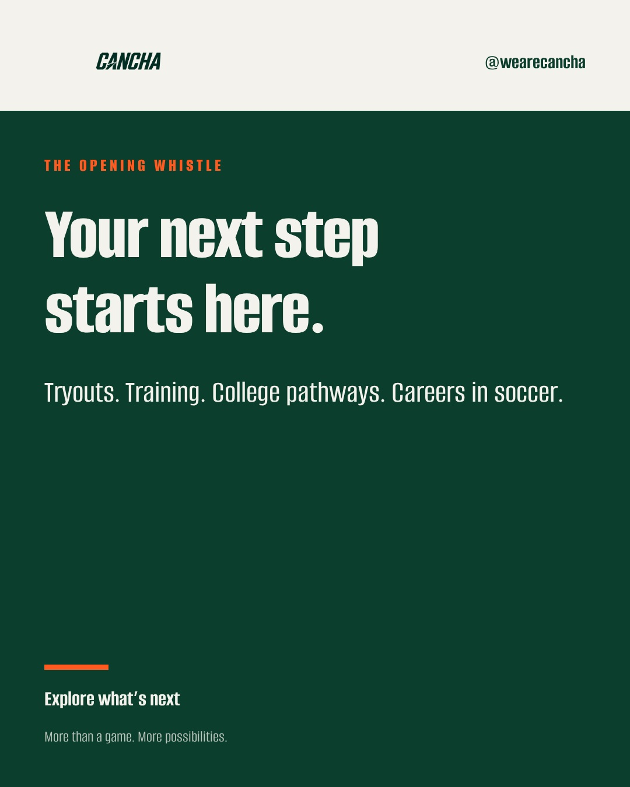
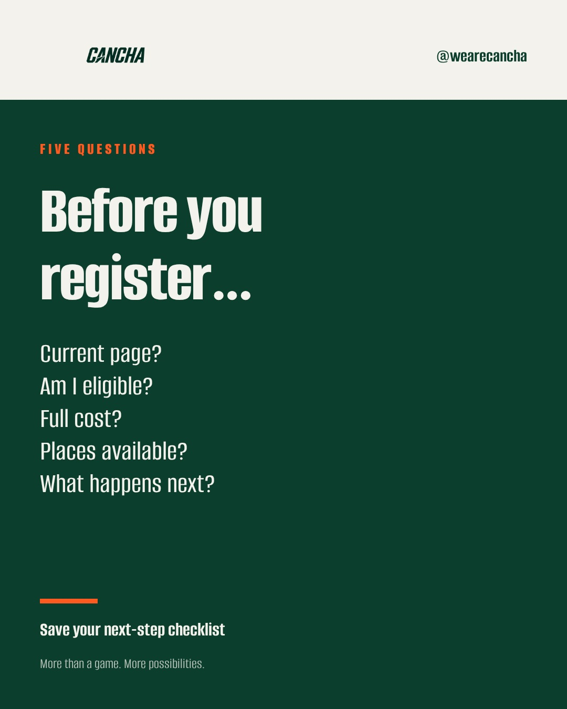
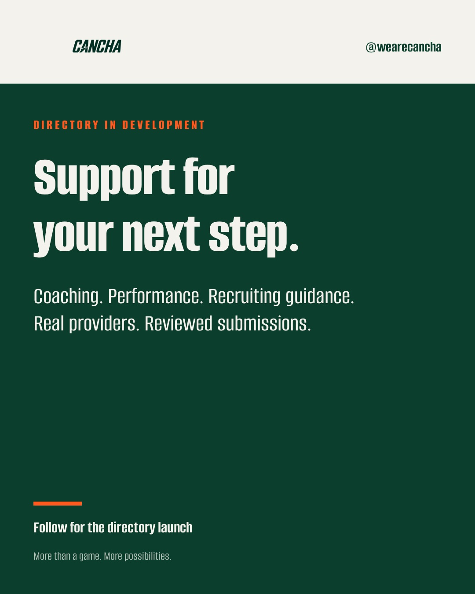
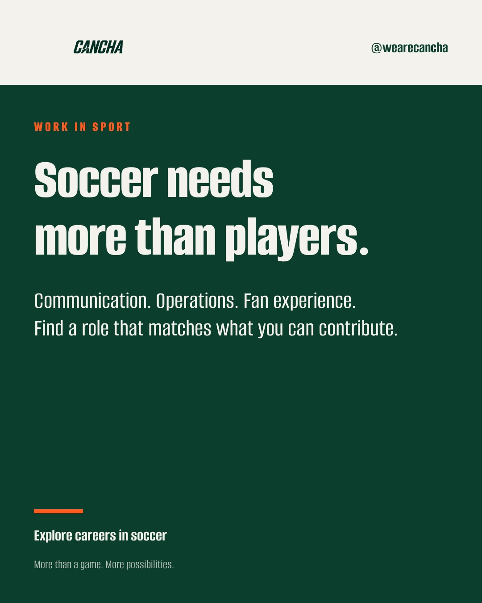
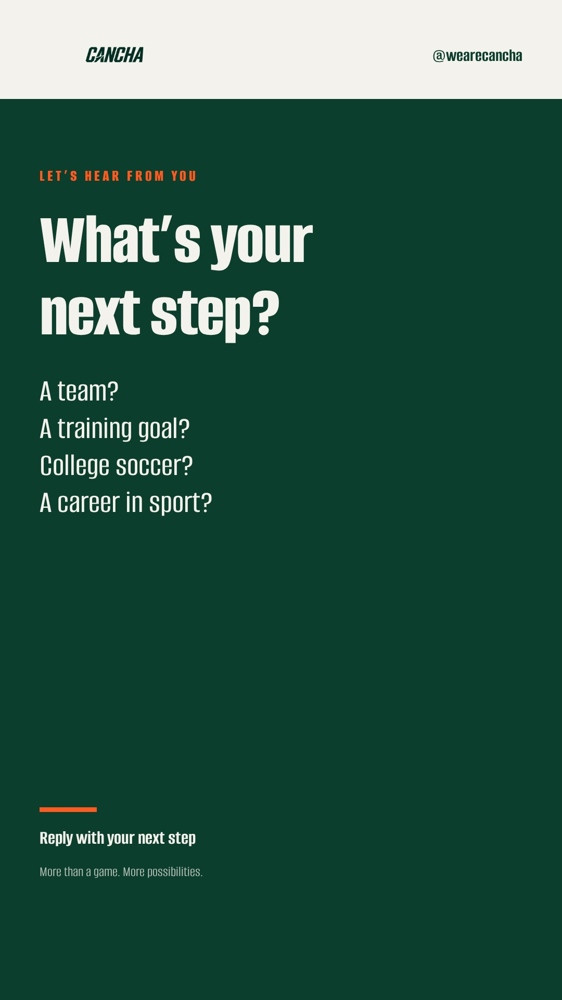
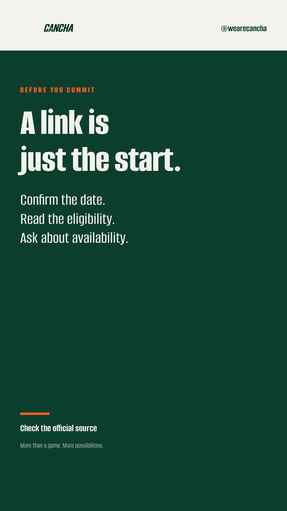

# Cancha Instagram drafts

Four feed posts and two Story images. All six remain **Draft**, with no scheduled dates. Review copy, artwork and links before approving. Proposal: three feed posts a week and two Stories, adjusted after observing real results. Times should be chosen in America/New_York and saved as UTC; no times have been selected.

## Cancha Introduction

Your next step in soccer can take more than one shape. Cancha brings opportunities and practical questions together so you can explore what fits your goals. Check the organizer’s current details before applying. Start with Explore through the link in our bio.

#Cancha #SoccerCommunity #FloridaSoccer

**Alt text:** Cancha introduction on a dark green background: Your next step starts here. Tryouts, training, college pathways and careers in soccer.

**Review note:** Confirm the Instagram bio links to Cancha before approving.

## Registration Checklist

A working registration button does not always mean a confirmed place. Before committing, check the organizer’s current page, exact eligibility, full cost, remaining availability and next steps. Save the terms and your confirmation.

Save this checklist for your next search.

#Cancha #SoccerTryouts #SoccerParents

**Alt text:** Five-question registration checklist in Cancha green and cream: current page, eligibility, cost, availability and next steps.

## Providers Coming Soon

We’re building Cancha’s provider directory for people looking for support in soccer, in Florida and online. No provider profiles are listed yet. Real submissions will be reviewed before appearing. Follow @wearecancha for the launch.

#Cancha #SoccerCoaching #AthleteSupport

**Alt text:** Provider directory announcement with the headline Support for your next step and a directory in development label.

**Review note:** Keep the coming-soon wording until provider intake and directory are live.

## Career Beyond Pitch

Your next role in soccer can be beyond the pitch. Read the responsibilities, required experience, location and schedule—not just the job title. Use your own work to show what you can contribute, and apply through the employer’s current posting.

Explore current roles through the link in our bio.

#Cancha #SportsCareers #SoccerJobs

**Alt text:** Cancha career card: Soccer needs more than players. Communication, operations and fan experience.

## Community Question

What are you looking for next in soccer? Reply to this story—we want to hear what would help.

**Alt text:** Cancha question story asking whether your next step is a team, training, college soccer or a career in sport.

**Review note:** Interactive poll/question stickers need manual setup in Instagram; the API image does not add one.

## Check Before Commit

Check the organizer’s current details before you commit.

**Alt text:** Cancha story checklist: confirm the date, read eligibility and ask about availability.

**Review note:** Add a link sticker manually if desired; automated story image publishing does not add a clickable link sticker.

The CSV alongside this file is a review/export format, not a claimed Metricool-native import. Images use Cancha branding; no stock person is presented as a real Cancha story and no provider or partner is invented. Interactive Story stickers need manual Instagram setup.
